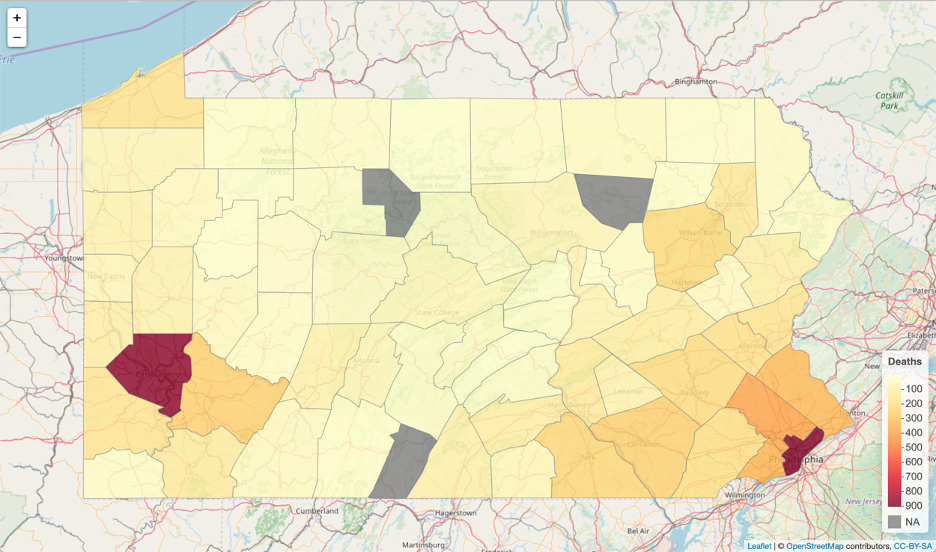
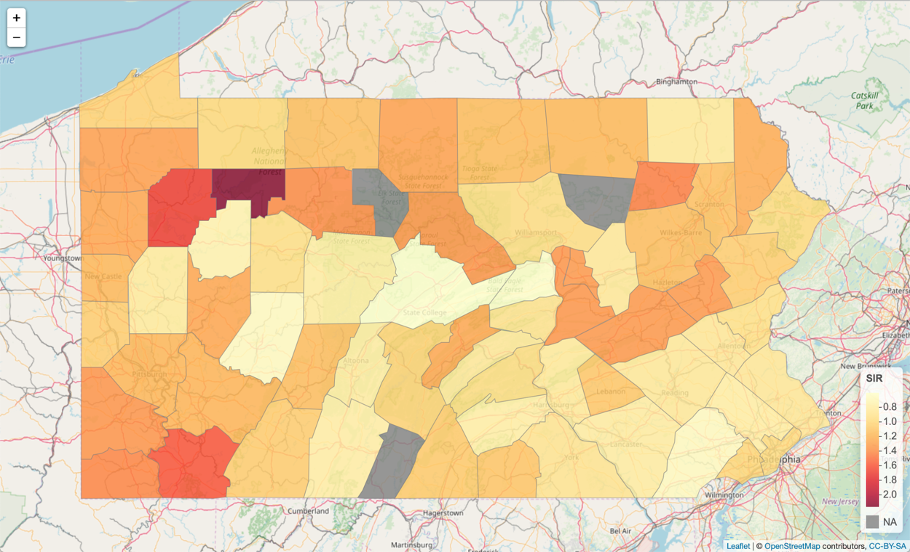
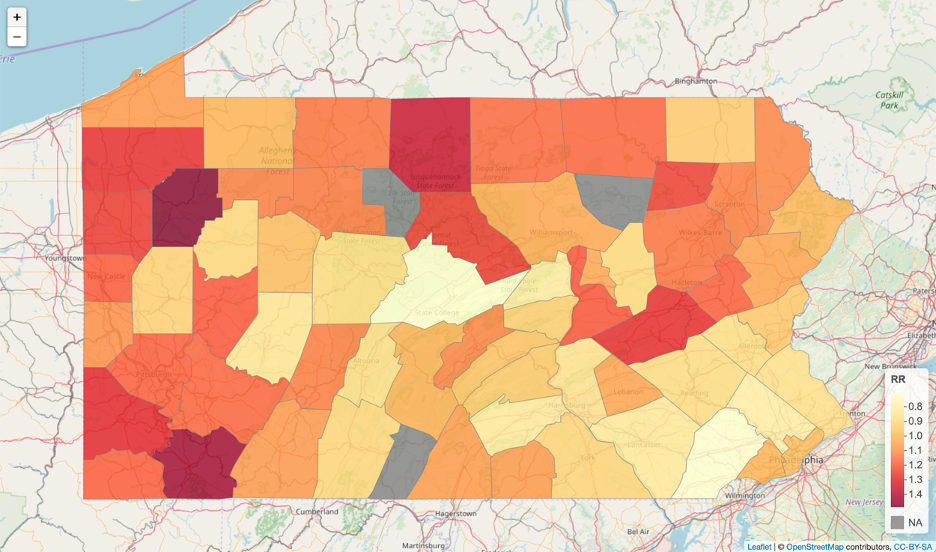

## Disease Risk Mapping with R-INLA Under Bayesian Framework With Application to Lung Cancer Mortality in Pennsylvania

Authors: Xiaoqing Tan, Anran Liu, Liwen Wu
Affiliation: Department of Biostatistics, University of Pittsburgh

For this project, we discussed the characteristics of spatial data and Bayesian approaches in spatial modeling. Due to the complex hierarchical structure of the spatial data, the Bayesian inference may be performed using the Integrated Nested Laplace Approximations (INLA) approach, which is a computational alternative to Markov chain Monte Carlo (MCMC) that allows to do approximate Bayesian inference in latent Gaussian models (LGMs). This approach is implemented in the R package called INLA.  

We then gave a practical example where we modeled the risk of lung cancer mortality in Pennsylvania in 2012 with smoking percentage and Radon level data in 2002 with a Bayesian spatial model. We assumed a 10-year lag of the effects of smoking and Radon level. The spatial correlation was accounted for by a conditional independent autoregressive structure for neighboring counties. A weakly-informative prior was used in INLA for model inference. As we can see from the results, both the proportion of smokers and the level of radon in each county were positively associated with lung cancer mortality. Counties in western Pennsylvania, in general, showed a higher risk compared to eastern counties.  

However, there are a few limitations to our project. Firstly, the data quality was not good enough since the smoking data was estimated by a very small sample of the population in each county (i.e. hundreds) and the degree of underreporting of lung cancer mortality was unmeasured. Secondly, there were limited covariates in our model. In our model, we only incorporated the proportion of smokers and the radon level as covariates. There may exist other potentially important demographic variables such as air pollution, levels of arsenic in the drinking water that could affect the mortality. Besides, we failed to consider the temporal effect of the exposure and naively created a 10-year time lag between exposure variables and outcome. However, this time effect could be further investigated if we could have more information on the exposure status.

### Figures
Figure 1. Map of Observed lung cancer mortality in Pennsylvania (2012)

Figure 2. Map of Standardized incidence ratio of lung cancer mortality in Pennsylvania (2012)

Figure 3. Map of Relative Risk for Lung Cancer Mortality in Pennsylvania (2012)

